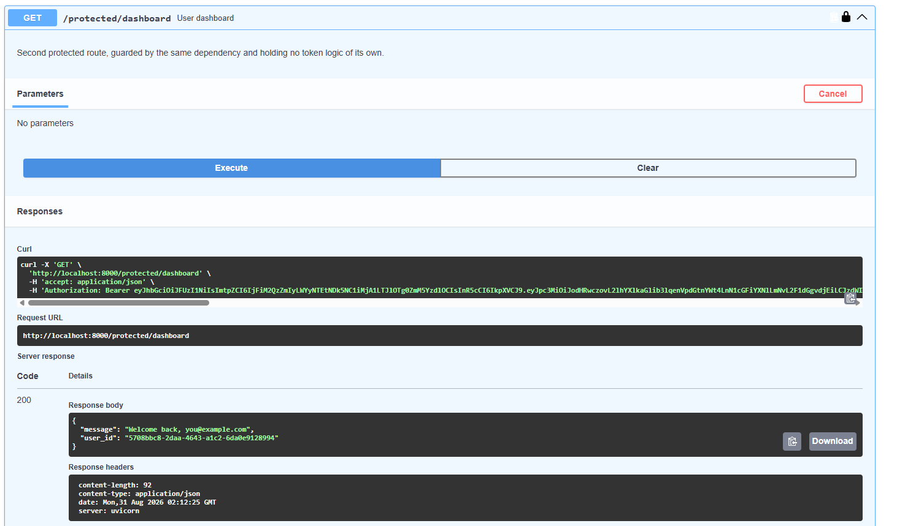
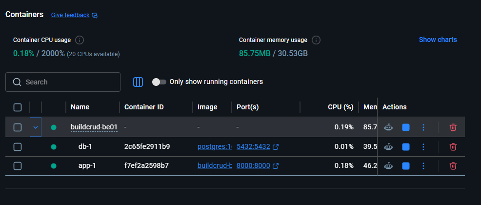

# Task API — con autenticación Supabase

A FastAPI service with two halves: a **Supabase-backed authentication layer** that issues and verifies JWTs, and the CRUD task API it grew out of. Sign up, log in, get an access token, and use it to open the routes under `/protected/`.

Passwords are never handled by this server. The client sends credentials, Supabase validates them and returns a signed JWT, and this API's only job is to verify that token on every protected request.

## Quick start

```
git clone https://github.com/Wallyway/BuildCRUD-BE01.git
cd BuildCRUD-BE01
cp .env.example .env          # fill in your own Supabase values
pip install -r requirements.txt
DB_BACKEND=sqlite uvicorn main:app --port 8000
```

The server logs `Server running and connected to Supabase` on startup. Interactive docs at http://localhost:8000/docs.

For the full stack with PostgreSQL in Docker, use `docker compose up` instead — the app service reads the same `.env`.

## Configuration

Settings come from `.env`, which is gitignored and never committed. `.env.example` carries the same keys with placeholder values:

| Variable | Purpose |
|-------------------|--------------------------------------------------|
| SUPABASE_URL      | Project URL, from Project Settings → API         |
| SUPABASE_KEY      | Publishable (anon) key, from the same page       |
| DB_BACKEND        | `postgres` or `sqlite`                           |
| DATABASE_URL      | Postgres connection string                       |
| SQLITE_PATH       | Database file used by the sqlite backend         |
| POSTGRES_USER     | Credentials the database container is created with |
| POSTGRES_PASSWORD | Credentials the database container is created with |
| POSTGRES_DB       | Credentials the database container is created with |

### Supabase project setup

In your Supabase dashboard, under **Authentication → Sign In / Providers → Email**:

- **Enable email provider** must be on, otherwise signup fails with `Email signups are disabled`.
- **Confirm email** must be off for the signup → login → token flow to work in one go. Leave it on and signup still returns 201, but no session is issued until the user clicks the link in their inbox.

You can check both from the outside:

```
$ curl -s "$SUPABASE_URL/auth/v1/settings" -H "apikey: $SUPABASE_KEY" | jq '.external.email, .mailer_autoconfirm'
true
true
```

## API reference

| Method | Path                   | Auth required | Description                                  |
|--------|------------------------|---------------|----------------------------------------------|
| POST   | /auth/signup           | no            | Create an account. 201 with the user object  |
| POST   | /auth/login            | no            | Exchange credentials for an access token     |
| POST   | /auth/logout           | **yes**       | End the session. 204, token stops working    |
| GET    | /public/info           | no            | Open message, no token needed                |
| GET    | /protected/profile     | **yes**       | id, email and created_at of the token holder |
| GET    | /protected/dashboard   | **yes**       | Second protected route, same guard           |
| GET    | /                      | no            | API info                                     |
| GET    | /health                | no            | Health check                                 |
| GET    | /tasks                 | no            | List all tasks                               |
| GET    | /tasks/{id}            | no            | Get a single task                            |
| POST   | /tasks                 | no            | Create a task                                |
| PUT    | /tasks/{id}            | no            | Update a task's title and/or done            |
| DELETE | /tasks/{id}            | no            | Delete a task                                |

Errors always come back in the same shape, `{"error": "..."}`:

| Status | When |
|--------|------------------------------------------------------------|
| 400    | Missing email or password, or Supabase rejected the signup  |
| 401    | Wrong credentials, missing header, invalid or expired token |
| 404    | Unknown task id                                             |

## The flow, end to end

```
$ curl -s -X POST localhost:8000/auth/signup -H "Content-Type: application/json" \
    -d '{"email":"you@example.com","password":"password123"}' -w "\nHTTP %{http_code}\n"
{"user":{"id":"8bde034d-f3d2-4298-9192-4602df3021f3","email":"you@example.com",...}}
HTTP 201

$ curl -s -X POST localhost:8000/auth/login -H "Content-Type: application/json" \
    -d '{"email":"you@example.com","password":"password123"}'
{"access_token":"eyJhbGciOiJFUzI1NiIsImtpZCI6...","refresh_token":"...","token_type":"bearer","expires_in":3600,"user":{...}}

$ TOKEN=<paste the access_token>

$ curl -s localhost:8000/protected/profile -H "Authorization: Bearer $TOKEN"
{"id":"935a9a9d-e8ac-45ca-a550-8b912efdb882","email":"you@example.com","created_at":"2026-08-30T14:32:23.783538+00:00"}
```

And the doors that stay shut:

```
$ curl -s localhost:8000/protected/profile -w "\nHTTP %{http_code}\n"
{"error":"Access token required"}
HTTP 401

$ curl -s localhost:8000/protected/profile -H "Authorization: Bearer ${TOKEN}x" -w "\nHTTP %{http_code}\n"
{"error":"Invalid or expired token"}
HTTP 401

$ curl -s -X POST localhost:8000/auth/login -H "Content-Type: application/json" \
    -d '{"email":"you@example.com","password":"wrong"}' -w "\nHTTP %{http_code}\n"
{"error":"Invalid login credentials"}
HTTP 401
```

Logout is not cosmetic. It deletes the session in Supabase, so the same token that worked a second earlier stops working:

```
$ curl -s -o /dev/null -X POST localhost:8000/auth/logout -H "Authorization: Bearer $TOKEN" -w "HTTP %{http_code}\n"
HTTP 204

$ curl -s localhost:8000/protected/profile -H "Authorization: Bearer $TOKEN" -w "\nHTTP %{http_code}\n"
{"error":"Invalid or expired token"}
HTTP 401
```

## Swagger UI

`/docs` shows a padlock next to `/auth/logout`, `/protected/profile` and `/protected/dashboard`. Click **Authorize**, paste the `access_token` from `/auth/login`, and Try it out works from the browser:



The security scheme comes from FastAPI's `HTTPBearer`, declared once in `auth_dependency.py` and picked up automatically by every route that depends on it:

```
$ curl -s localhost:8000/openapi.json | jq .components.securitySchemes
{"HTTPBearer": {"type": "http", "description": "Paste the access_token returned by POST /auth/login", "scheme": "bearer"}}
```

## How the guard works

| File | Role |
|---------------------|-------------------------------------------------------|
| `auth_service.py`   | The Supabase client, and every call into it            |
| `auth_dependency.py`| `HTTPBearer` scheme and the `require_user` dependency   |
| `auth_routes.py`    | `/auth/signup`, `/auth/login`, `/auth/logout`           |
| `access_routes.py`  | `/public/info` and the `/protected/*` routes            |
| `errors.py`         | The `{"error": "..."}` response model shared by the docs |

The token check lives in exactly one place. `require_user` pulls the credentials off the header, rejects anything missing or malformed with 401, hands the token to `supabase.auth.get_user()`, and returns the verified user. A protected route is then just a route with one extra argument:

```python
@router.get("/protected/dashboard", ...)
def dashboard(user: User = Depends(require_user)):
    return {"message": f"Welcome back, {user.email}", "user_id": user.id}
```

Two details worth knowing:

- FastAPI's `HTTPBearer` answers a missing header with **403**, not the 401 this API promises. It is constructed with `auto_error=False` so the 401 is raised deliberately, with the right body.
- The server is stateless and only ever sees an access token, never a stored session, so logout goes through `supabase.auth.admin.sign_out(token)` — which forwards that token to Supabase's logout endpoint — instead of the session-based `sign_out()`.

## The task API underneath

The CRUD half of this project is unchanged and still public. It runs against PostgreSQL or SQLite, chosen by `DB_BACKEND`, behind a repository interface:

| File | Role |
|--------------------|-------------------------------------------------|
| `repository.py`    | `TaskRepository` protocol, the interface         |
| `repo_sqlite.py`   | SQLite implementation                            |
| `repo_postgres.py` | PostgreSQL implementation                        |
| `service.py`       | Validation rules, 400 and 404 decisions          |
| `routes.py`        | HTTP endpoints, delegating to the service        |
| `main.py`          | Wiring: picks a repository, builds the app       |

```
$ curl -i -X PUT localhost:8000/tasks/4 -H "Content-Type: application/json" -d '{"done":true}'
HTTP/1.1 200 OK

{"id":4,"title":"Buy milk","done":true}
```

### Persistence

`docker compose up` builds the app image, starts PostgreSQL with the named volume `pgdata`, waits for it to report healthy, and then starts the API. The volume is what survives: `docker compose down` removes the containers and keeps the data, `docker compose down -v` wipes it.

The schema and three seed tasks come from [db/init.sql](db/init.sql), mounted into `/docker-entrypoint-initdb.d/`. Postgres runs that directory only when the volume is empty, so the seeds are inserted once and never again.

```
$ curl -s -X POST localhost:8000/tasks -H "Content-Type: application/json" -d '{"title":"Sobrevive al reinicio"}'
{"id":5,"title":"Sobrevive al reinicio","done":false}

$ docker compose down && docker compose up -d

$ curl -s localhost:8000/tasks
[{"id":1,...},{"id":2,...},{"id":3,...},{"id":5,"title":"Sobrevive al reinicio","done":false}]
```

Task 5 is still there after both containers were destroyed and rebuilt.



More SQL in [docs/queries.sql](docs/queries.sql).
